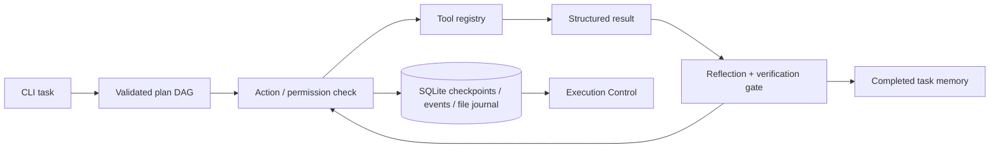

# MyAgent · Execution Control


Turn a task into a plan, execute tools, check the result, and resume from a durable checkpoint. Inspect the actual file changes and test results in **Execution Control**, the included local browser viewer.

**Version 1.0 is written from scratch.** It replaces the earlier collection of agent, skill, memory, and provider modules with a small typed runtime and an explicit execution state machine. The earlier implementation remains available in Git history.

Execution Control is a dark developer workspace with a dependency graph, inline telemetry, source diffs, and persisted tool output. [Design notes](docs/DESIGN.md) · [Interface gallery](docs/SCREENSHOTS.md).

## Try a real execution without a model

Requires Python 3.11+ on macOS or Linux.

```bash
python3 -m venv .venv
source .venv/bin/activate
python -m pip install -e '.[dev]'
myagent demo --workspace /tmp/myagent-demo
myagent serve --workspace /tmp/myagent-demo
```

Open **http://127.0.0.1:8001**. The demo creates a temperature-conversion module and its tests, executes pytest, records results, and exposes the file diff. **The demo's model decisions are a deterministic replay; the file operations, tests, persistence, and browser view are real.** Use a fresh demo directory each time.

## Run your own task

Start an Ollama server and provide the name of a model you have installed:

```bash
myagent run 'Add input validation and tests to the parser' \
  --workspace /path/to/project \
  --provider ollama --model your-installed-model \
  --allow-write --allow-exec
```

OpenAI-compatible services use `--provider openai --base-url https://api.openai.com/v1 --model YOUR_MODEL`. Set the key through `MYAGENT_API_KEY`; keys are not stored in run checkpoints. `MYAGENT_PROVIDER`, `MYAGENT_MODEL`, and `MYAGENT_BASE_URL` provide defaults. The example `.env` file is not loaded automatically.

File writes and process execution require separate flags. A run pauses if it needs a permission that was not granted. Granting `--allow-exec` allows arbitrary programs with your user account's filesystem/network access; it is **not an operating-system sandbox**. Run unfamiliar projects in a disposable container or VM. Remote models receive the task and selected workspace context.

```bash
myagent runs --workspace /path/to/project
myagent show RUN_ID --workspace /path/to/project
myagent resume RUN_ID --workspace /path/to/project --allow-write --allow-exec
myagent undo RUN_ID --workspace /path/to/project
myagent doctor --workspace /path/to/project
```

## What makes the runtime useful

- **Plan–Act–Reflect:** a validated dependency graph, one structured action at a time, a separate reflection step, bounded retries, and explicit completion checks. A model cannot mark plan steps complete before executing them.
- **Typed tool contracts:** file listing/reading, literal search, AST repository maps, file writes and exact edits, subprocess commands, pytest, and Git diff. Register another tool with its schema, permission, and handler.
- **Verified execution:** real exit codes, timeouts that terminate the process group, bounded output, XML-safe JUnit parsing, and failure when no tests pass. Code or command mutations invalidate previous verification.
- **Durable runs:** SQLite checkpoints and ordered events, a lock against concurrent resumes, call/time/action budgets, and persistent memory of completed tasks scoped to the workspace.
- **Careful edits:** workspace containment, protected paths, current-content hashes, unique replacement spans, Python syntax checks before writes, and atomic replacement with original bytes recorded.
- **Review and recovery:** a responsive browser viewer for task steps, event history, test counts, and file diffs. Undo checks all file hashes before restoring file-tool changes and refuses to overwrite subsequent user edits.

## Interruption and verification

Each tool intent is saved **before execution**. If the process stops between the action and its result, resume pauses for review; it does not blindly repeat that action. Inspect the workspace and run history, then pass `--acknowledge-interrupted` to let the model continue from current state.

Undo restores only changes made by `write_file` and `edit_file`. Shell commands can have side effects outside the workspace and are not automatically reversible. Multiple file restores are preflight-checked but are not a filesystem-wide transaction.

The default budgets are 40 model calls, 600 seconds of accumulated runtime, 12 tool actions per step, and two reflection retries. A budget pause can be resumed with larger limits. Purely informational tasks do not require pytest; mutations require a successful `run_tests` after the latest change before the run can report success. This intentionally targets Python projects for automated verification.

## Architecture and development



```bash
pytest --cov=myagent --cov-report=term-missing
ruff check .
ruff format --check .
python -m build
```

The default install includes pytest because it is a runtime verification tool. The browser viewer binds to loopback and provides read-only access to runs; it is not an authenticated multi-user service. See [architecture](docs/ARCHITECTURE.md), [validation](docs/VALIDATION.md), and [migration](docs/MIGRATION.md).

MIT license. Protocol references: [Ollama structured outputs](https://docs.ollama.com/capabilities/structured-outputs), [OpenAI structured outputs](https://developers.openai.com/api/docs/guides/structured-outputs).
