# myAgent Roadmap: Building an Autonomous Coding Agent

> Goal: Build a coding agent that can autonomously develop complete projects using local 8B/9B models
> Reference: Claude Code open-source architecture

---

## Overall Architecture

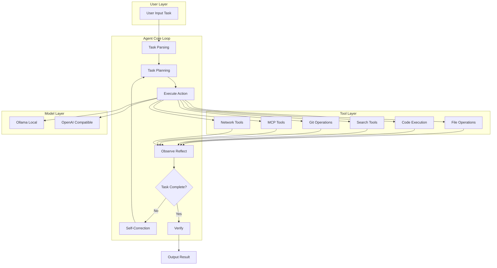

---

## Phase 1: Core Agent Architecture Enhancement

### 1.1 Multi-Round Planning Loop (Plan → Act → Reflect)

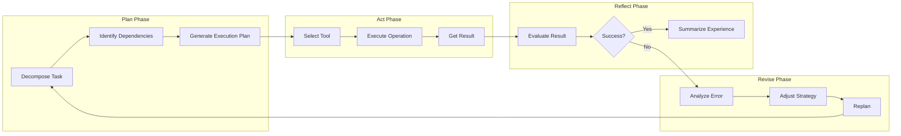

### 1.2 Task Queue and Subtask Decomposition

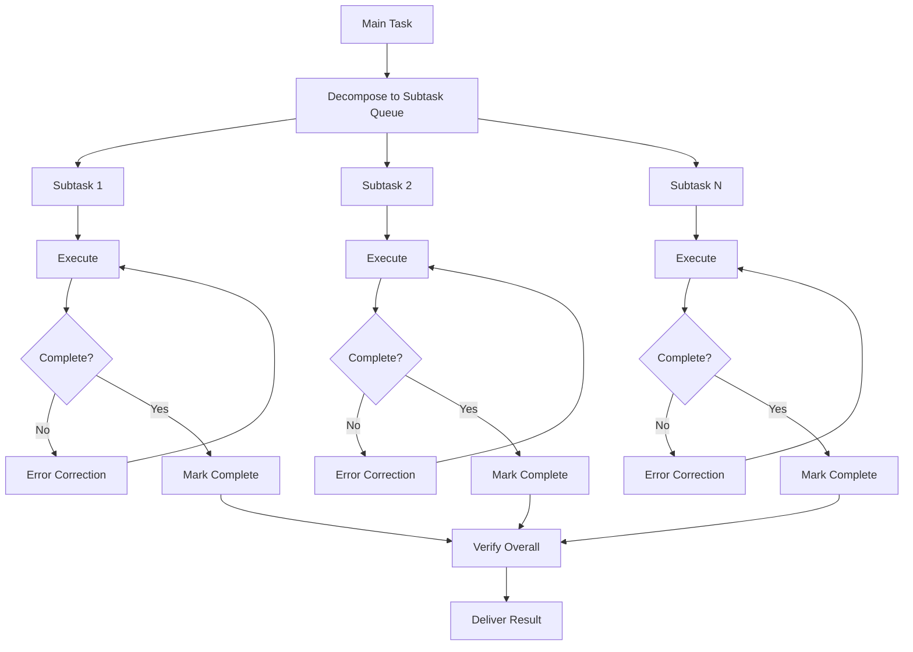

### 1.3 Self-Correction Mechanism

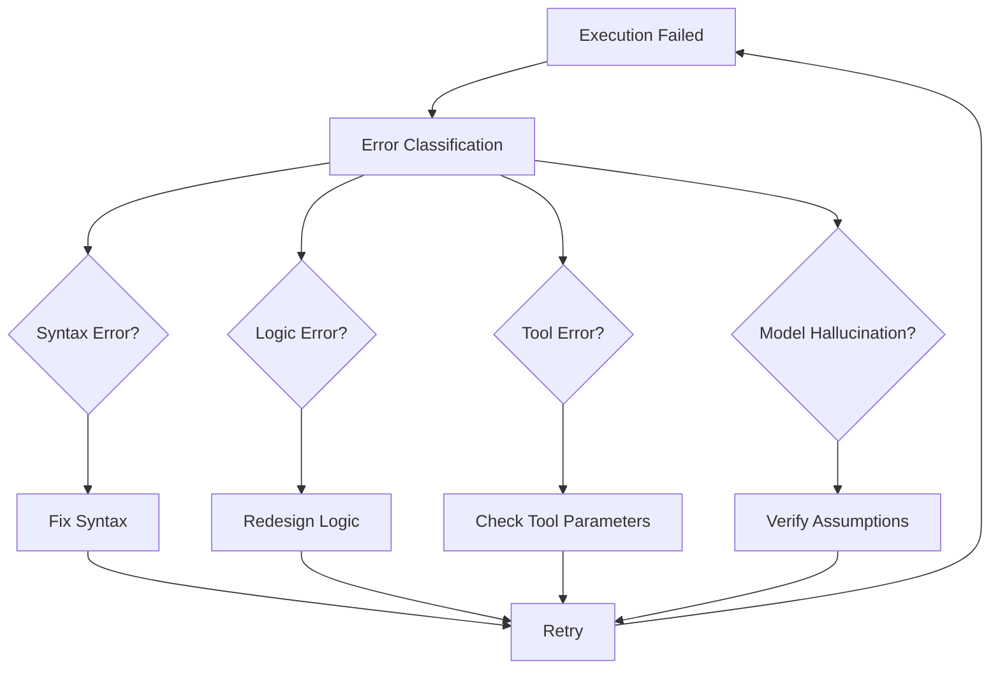

### 1.4 Structured Tool Calling

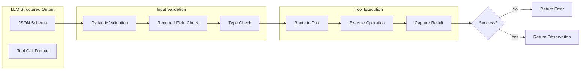

---

## Phase 2: Claude Code Core Features

### 2.1 MCP Integration Architecture

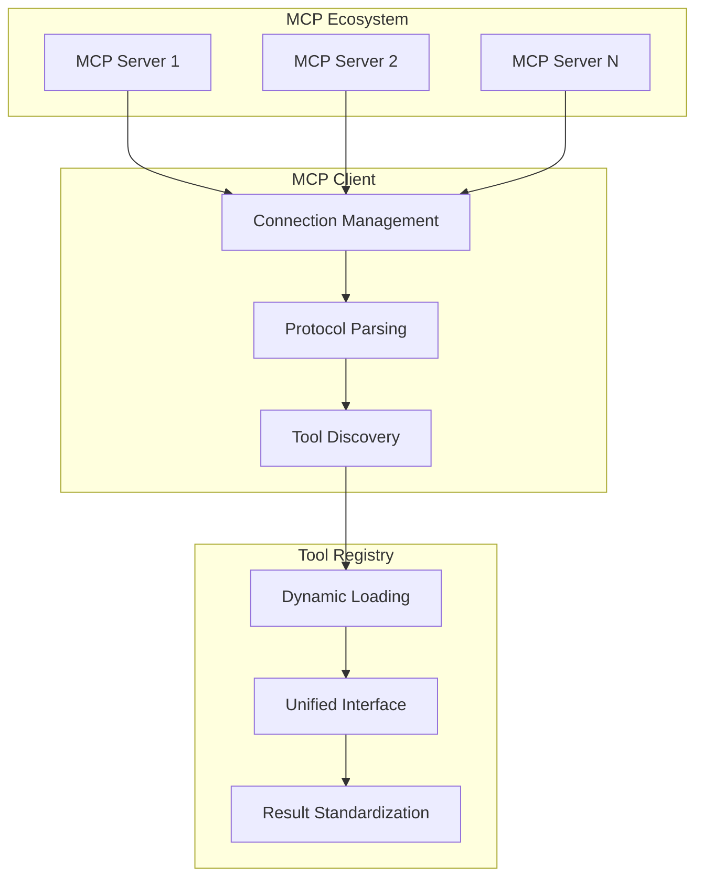

### 2.2 Process Monitoring

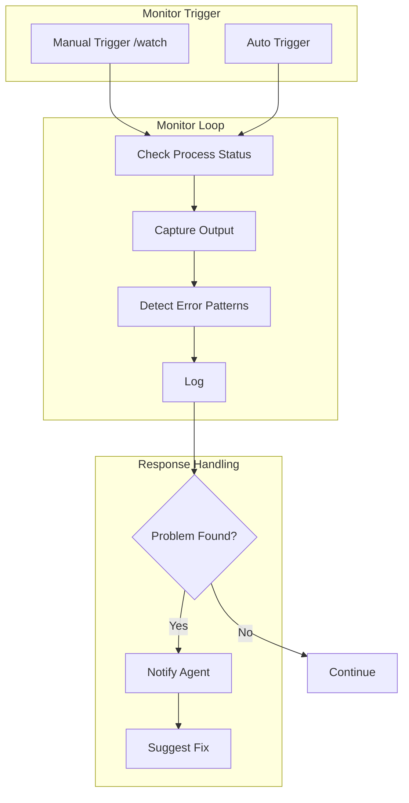

---

## Phase 3: Small Model Adaptation

### 3.1 Chain-of-Thought Prompt Templates

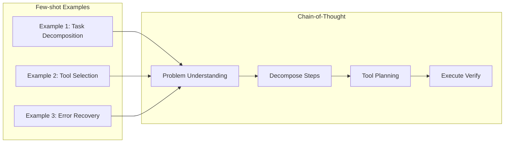

### 3.2 Fallback Strategies

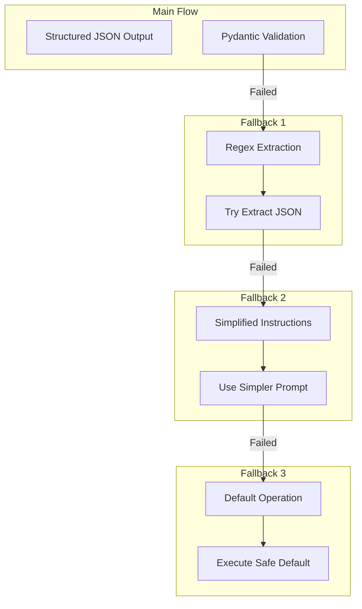

---

## Phase 4: Validation and Iteration

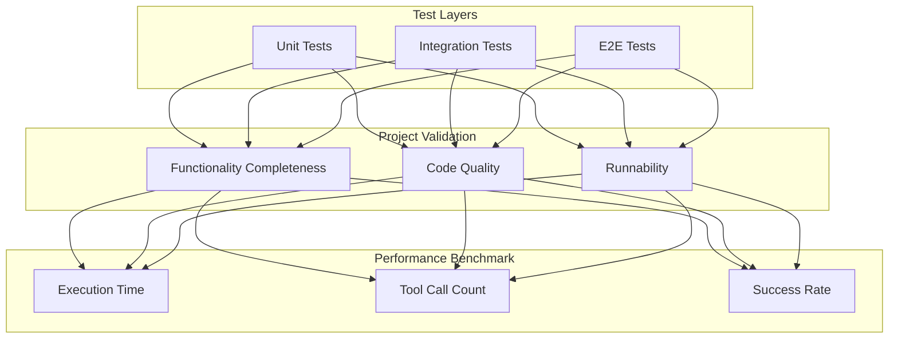

---

## Implementation Priority

| Priority | Phase | Task | Estimated Time |
|----------|-------|------|----------------|
| P0 | Phase 1 | Refactor Agent loop to Plan/Act/Reflect | 2-3 days |
| P0 | Phase 1 | Implement task queue and decomposition | 1-2 days |
| P1 | Phase 1 | Self-correction mechanism | 1-2 days |
| P1 | Phase 1 | Enhance structured output | 1 day |
| P2 | Phase 2 | MCP client integration | 2-3 days |
| P2 | Phase 2 | Process monitoring | 1-2 days |
| P3 | Phase 3 | Small model adaptation | Ongoing |
| P3 | Phase 4 | Testing and validation | Ongoing |

---

## File Structure

```
myAgent/
├── main.py                 # Entry point
├── agent/
│   ├── __init__.py
│   ├── engine.py          # Agent core engine (Plan/Act/Reflect)
│   ├── planner.py         # Task planning and decomposition
│   ├── executor.py        # Tool executor
│   ├── reflector.py       # Result reflection and correction
│   └── tools/
│       ├── __init__.py
│       ├── base.py        # Tool base class
│       ├── file_tools.py  # File operations
│       ├── exec_tools.py  # Execution tools
│       ├── search_tools.py # Search tools
│       ├── git_tools.py   # Git operations
│       ├── test_tools.py  # Test tools
│       ├── quality_tools.py # Quality tools
│       ├── dependency_tools.py # Dependency tools
│       ├── deploy_tools.py # Deployment tools
│       └── mcp_tools.py   # MCP integration
├── cli/
│   └── michael.py         # CLI interface
├── memory/                 # External memory
│   ├── state_manager.py  # Progress & checkpoints
│   ├── embedding_store.py # Embedding storage
│   └── external_memory.py # Workflow orchestrator
├── utils/
│   ├── model_provider.py  # Multi-provider (Ollama, OpenAI, Anthropic)
│   ├── llm_cache.py      # LLM response caching
│   ├── cost_tracker.py   # Cost tracking
│   └── persistent_memory.py
├── skills/                # Built-in skills
│   └── registry.py
└── tests/
```

---

*Last Updated: 2026-04-21*

---

## Modular Refactoring (2026-04-21)

Refactored code according to ROADMAP structure, new modules:

| Module | Status | Description |
|--------|--------|-------------|
| `agent/tools/` | ✅ | Tool modularization |
| `agent/tools/base.py` | ✅ | Base tool class |
| `agent/tools/file_tools.py` | ✅ | File operation tools |
| `agent/tools/exec_tools.py` | ✅ | Execution tools |
| `agent/tools/search_tools.py` | ✅ | Search tools |
| `agent/tools/git_tools.py` | ✅ | Git operation tools |
| `agent/tools/test_tools.py` | ✅ | Test tools |
| `agent/tools/quality_tools.py` | ✅ | Quality tools |
| `agent/tools/dependency_tools.py` | ✅ | Dependency tools |
| `agent/tools/deploy_tools.py` | ✅ | Deploy tools |
| `agent/tools/mcp_tools.py` | ✅ | MCP tools |
| `utils/llm_cache.py` | ✅ | LLM response caching |
| `utils/cost_tracker.py` | ✅ | Cost tracking |
| `agent/coordinator.py` | ✅ | Multi-agent coordination |

## Current Progress

### ✅ Completed

| Phase | Content | Completion Date |
|-------|---------|-----------------|
| Phase 1 | Agent core architecture (Plan/Act/Reflect) | 2026-04-20 |
| Phase 2.1 | Interactive CLI | 2026-04-20 |
| Phase 2.2 | MCP client integration | 2026-04-21 |
| Phase 2.3 | Process monitoring (/watch) | 2026-04-21 |
| Phase 2.4 | Skills system | 2026-04-21 |
| Phase 3 | Small model adaptation (CoT prompts + fallback) | 2026-04-21 |
| Phase 4.1 | Unit tests + Integration tests | 2026-04-20 |
| Phase 4.2 | E2E tests | 2026-04-20 |
| Phase 4.3 | Performance benchmarks | 2026-04-20 |
| Layer 1 | External Memory System - Core Interface | 2026-04-27 |
| Layer 3 | External Memory System - ChromaDB + Ollama Embeddings | 2026-04-28 |

### ⏳ Pending

- None

### 📊 Test Coverage

```
tests/
├── test_agent.py           # Agent core functionality tests
├── test_llm_models.py      # LLM model capability tests
├── test_phase3_small_model.py  # Small model optimization tests
├── test_skills_models.py   # Skills system tests
├── test_phase4_validation.py   # Phase 4 validation tests
├── test_memory_interface.py   # Memory interface tests
└── test_e2e.py             # End-to-end tests
```

---

## Skills System (Implemented)

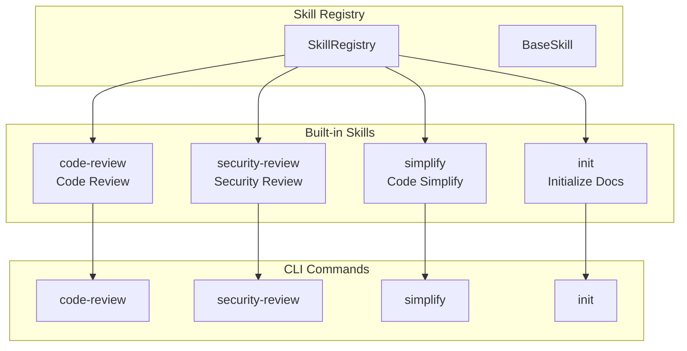

### Built-in Skills

| Command | Function |
|---------|----------|
| `/code-review` | Code review (TODO/FIXME, debug statements, empty exceptions) |
| `/security-review` | Security scan (hardcoded passwords, SQL injection, shell injection) |
| `/simplify` | Code refactoring (duplicate code, long functions) |
| `/init` | Initialize CLAUDE.md project documentation |

---

## External Memory System - Layer 1 Implementation Plan

> Based on Codex review feedback, using strategic shortcuts: minimal memory interface + mock embeddings, real vector search deferred to Layer 3

**Architecture Decisions:**
1. Minimal memory interface prioritized over storage and embeddings
2. Using mock embeddings for MVP, real Ollama embeddings deferred
3. File append storage (no indexing), migrate to vector DB later

**Implementation Scope (Layer 1):**
- ✅ Memory interface: `remember()` and `recall()` methods
- ✅ Memory schema: Session metadata capture (files, tags, summaries)
- ✅ Append storage: JSON files under `memory/sessions/`
- ✅ `/search` CLI command (using mock embeddings)
- ✅ Auto-capture: Hook into `AgentEngine` task_complete phase

**Layer 3 Implementation (Completed 2026-04-28):**
- ✅ ChromaDB / Vector DB integration
- ✅ Real Ollama embedding generation (nomic-embed-text)
- ✅ Memory cleanup and expiration strategies
- ✅ Semantic similarity search

**Layer 3 Architecture:**
1. ChromaDB PersistentClient for vector storage with cosine similarity
2. OllamaEmbeddings class using nomic-embed-text model
3. MemoryCleanupPolicy with age-based and access-based cleanup
4. Hybrid search combining semantic (ChromaDB) and keyword matching

**Out of Layer 3 Scope (Future Layers):**
- ⏳ Cross-session memory linking and graph relationships
- ⏳ Importance scoring based on task outcomes
- ⏳ Memory summarization and compression

**File Changes (Layer 3):**
| File | Operation |
|------|-----------|
| `memory/embedding_store.py` | Complete rewrite with ChromaDB + Ollama embeddings |
| `memory/chroma_db/` | New ChromaDB persistent storage |

**Test Plan (Layer 3):**
- Semantic search accuracy testing
- Cleanup policy verification
- Ollama embedding fallback handling

**File Changes:**
| File | Operation |
|------|-----------|
| `memory/state_manager.py` | Extended richer metadata + retrieval API |
| `memory/embedding_store.py` | New (mock embeddings + text fallback) |
| `memory/external_memory.py` | Enhanced auto-capture |
| `agent/engine.py` | Hooked auto-capture |
| `cli/michael.py` | Added `/search` command |
| `utils/model_provider.py` | Reserved `get_embeddings()` interface |

**Test Plan:**
- `tests/test_memory_interface.py` - Memory interface + mock embeddings
- `tests/test_session_capture.py` - Session metadata capture
- `tests/test_search_flow.py` - /search command flow

**Risk Mitigation:**
- Embedding failure → Text keyword search fallback
- Storage corruption → Rebuild from session logs

*Last Updated: 2026-04-27*
