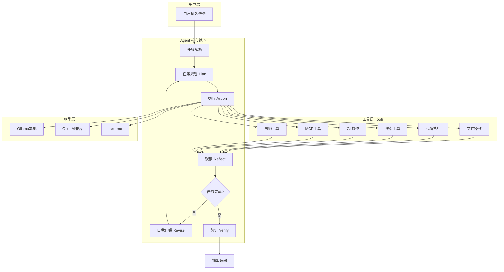
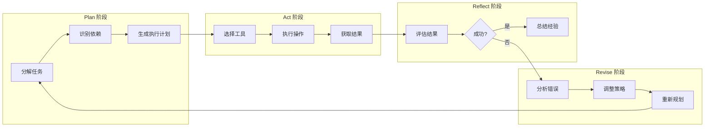
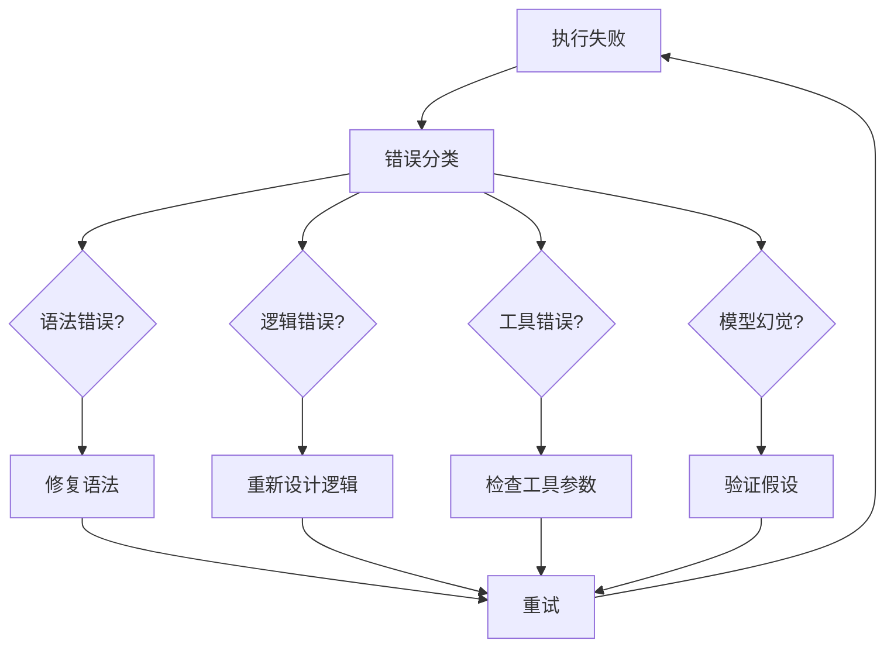
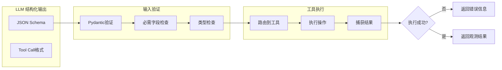
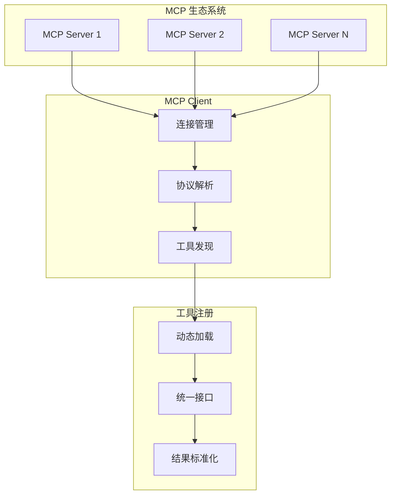
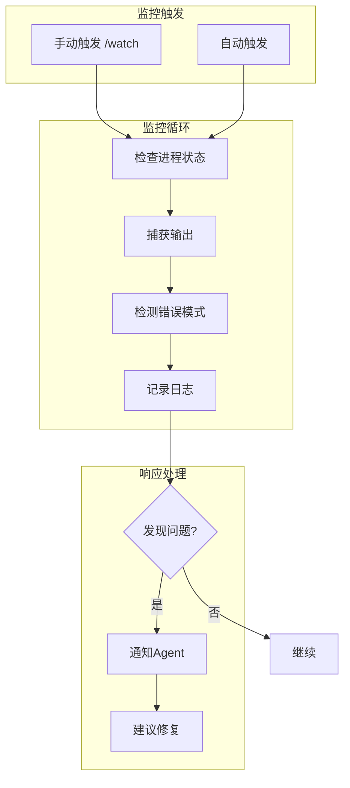
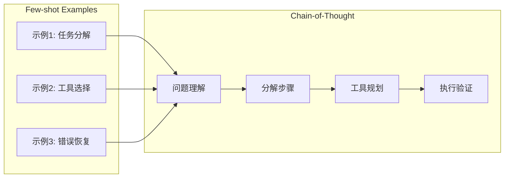
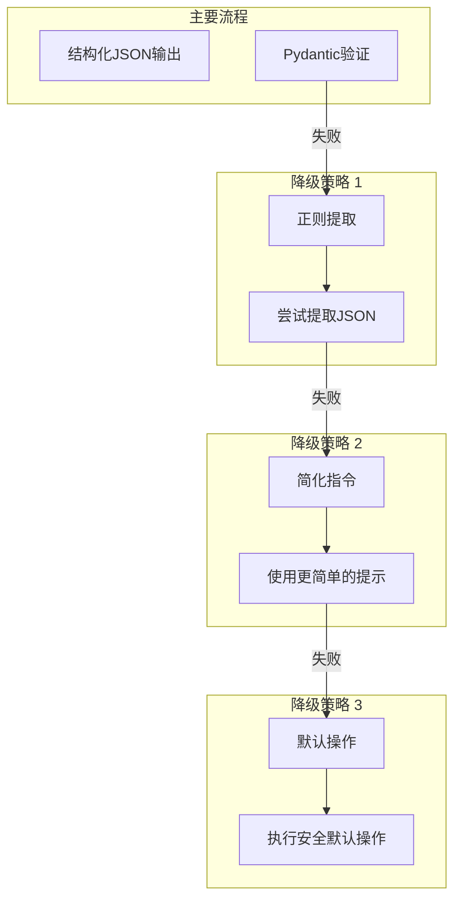
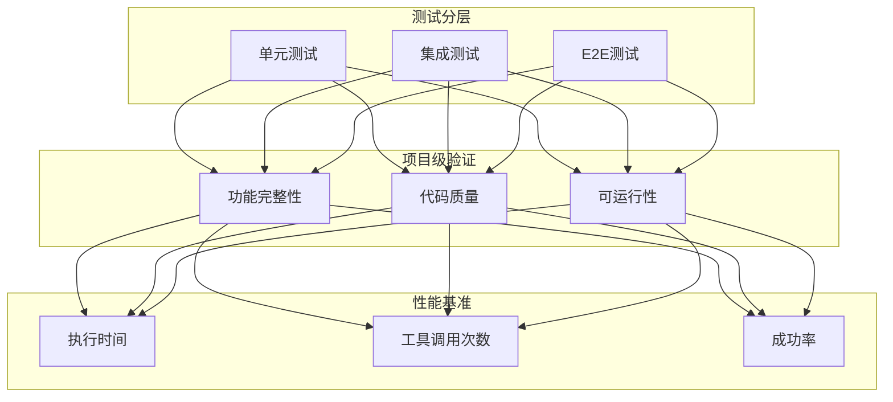

# MyAgent 路线图：构建自主Coding Agent

> 目标：用本地 8B/9B 小模型实现能够自主开发完整项目的 Coding Agent
> 参考：Claude Code 开源代码架构

---

## 整体架构流程图



---

## Phase 1: 核心 Agent 架构增强

### 1.1 多轮规划循环 (Plan → Act → Reflect)



### 1.2 任务队列与子任务分解

```mermaid
flowchart TD
    T1[主任务] --> T2[分解为子任务队列]
    T2 --> T3[子任务 1]
    T2 --> T4[子任务 2]
    T2 --> T5[子任务 N]

    T3 --> T3A[执行] --> T3B{完成?}
    T4 --> T4A[执行] --> T4B{完成?}
    T5 --> T5A[执行] --> T5B{完成?}

    T3B -- 否 --> E1[纠错] --> T3A
    T4B -- 否 --> E2[纠错] --> T4A
    T5B -- 否 --> E3[纠错] --> T5A

    T3B -- 是 --> C1[标记完成]
    T4B -- 是 --> C2[标记完成]
    T5B -- 是 --> C3[标记完成]

    C1 & C2 & C3 --> T6[验证整体]
    T6 --> T7[交付结果]
```



### 1.3 自我纠错机制



### 1.4 结构化工具调用



---

## Phase 2: Claude Code 核心功能

### 2.1 MCP 集成架构



### 2.2 进程监控能力



---

## Phase 3: 小模型适配

### 3.1 Chain-of-Thought 提示模板



### 3.2 降级与回退策略



---

## Phase 4: 验证与迭代



---

## 实现优先级

| 优先级 | 阶段 | 任务 | 预计时间 |
|--------|------|------|----------|
| P0 | Phase 1 | 重构 Agent 循环为 Plan/Act/Reflect | 2-3 天 |
| P0 | Phase 1 | 实现任务队列和分解 | 1-2 天 |
| P1 | Phase 1 | 自我纠错机制 | 1-2 天 |
| P1 | Phase 1 | 强化结构化输出 | 1 天 |
| P2 | Phase 2 | MCP 客户端集成 | 2-3 天 |
| P2 | Phase 2 | 进程监控能力 | 1-2 天 |
| P3 | Phase 3 | 小模型适配优化 | 持续 |
| P3 | Phase 4 | 测试和验证 | 持续 |

---

## 文件结构规划

```
MyAgent/
├── main.py                 # 入口
├── agent/
│   ├── __init__.py
│   ├── engine.py          # Agent 核心引擎 (Plan/Act/Reflect)
│   ├── planner.py         # 任务规划和分解
│   ├── executor.py        # 工具执行器
│   ├── reflector.py       # 结果反思和纠错
│   └── tools/
│       ├── __init__.py
│       ├── base.py        # 工具基类
│       ├── file_tools.py  # 文件操作
│       ├── exec_tools.py  # 执行工具
│       ├── search_tools.py # 搜索工具
│       └── mcp_tools.py   # MCP 集成
├── providers/
│   ├── __init__.py
│   ├── base.py           # Provider 基类
│   ├── ollama.py         # Ollama 实现
│   └── openai.py         # OpenAI 兼容
├── utils/
│   ├── __init__.py
│   ├── memory.py         # 对话记忆
│   ├── schema.py         # 结构化输出
│   └── logger.py         # 日志追踪
├── mcp/
│   ├── __init__.py
│   ├── client.py         # MCP 客户端
│   └── protocol.py      # MCP 协议
└── tests/
    ├── test_agent.py
    ├── test_tools.py
    └── test_e2e.py
```

---

*最后更新: 2026-04-21*

---

## 模块化重构 (2026-04-21)

根据 ROADMAP 结构重构代码，新增模块：

| 模块 | 状态 | 说明 |
|------|------|------|
| `agent/tools/` | ✅ | 工具模块化 |
| `agent/tools/base.py` | ✅ | 基础工具类 |
| `agent/tools/file_tools.py` | ✅ | 文件操作工具 |
| `agent/tools/exec_tools.py` | ✅ | 执行工具 |
| `agent/tools/search_tools.py` | ✅ | 搜索工具 |
| `agent/tools/git_tools.py` | ✅ | Git 操作工具 |
| `agent/tools/mcp_tools.py` | ✅ | MCP 工具 |
| `utils/memory.py` | ✅ | 对话记忆 |
| `utils/logger.py` | ✅ | 日志追踪 |
| `utils/schema.py` | ✅ | 结构化输出 |
| `mcp/protocol.py` | ✅ | MCP 协议定义 |

## 当前进度

### ✅ 已完成

| 阶段 | 内容 | 完成日期 |
|------|------|----------|
| Phase 1 | Agent 核心架构 (Plan/Act/Reflect) | 2026-04-20 |
| Phase 2.1 | 交互式 CLI | 2026-04-20 |
| Phase 2.2 | MCP 客户端集成 | 2026-04-21 |
| Phase 2.3 | 进程监控 (/watch) | 2026-04-21 |
| Phase 2.4 | Skills 系统 | 2026-04-21 |
| Phase 3 | 小模型适配优化 (CoT 提示 + 降级策略) | 2026-04-21 |
| Phase 4.1 | 单元测试 + 集成测试 | 2026-04-20 |
| Phase 4.2 | E2E 端到端测试 | 2026-04-20 |
| Phase 4.3 | 性能基准测试 | 2026-04-20 |

### ⏳ 待做

- 无

### 📊 测试覆盖

```
tests/
├── test_agent.py           # Agent 核心功能测试
├── test_llm_models.py      # LLM 模型能力测试
├── test_phase3_small_model.py  # 小模型优化测试
├── test_skills_models.py   # Skills 系统测试
├── test_phase4_validation.py   # Phase 4 验证测试 ⭐NEW
└── test_e2e.py             # 端到端测试 ⭐NEW
```

---

## Skills 系统 (已实现)

```mermaid
flowchart TD
    subgraph 技能注册["技能注册"]
        R1[SkillRegistry]
        R2[BaseSkill]
    end

    subgraph 内置技能["内置技能"]
        S1[code-review<br>代码审查]
        S2[security-review<br>安全审查]
        S3[simplify<br>代码简化]
        S4[init<br>初始化文档]
    end

    subgraph CLI命令["CLI 命令"]
        C1[/code-review]
        C2[/security-review]
        C3[/simplify]
        C4[/init]
    end

    R1 --> S1 & S2 & S3 & S4
    S1 --> C1
    S2 --> C2
    S3 --> C3
    S4 --> C4
```

### 内置 Skills

| 命令 | 功能 |
|------|------|
| `/code-review` | 代码审查（TODO/FIXME、调试语句、空异常等） |
| `/security-review` | 安全扫描（硬编码密码、SQL注入、shell注入等） |
| `/simplify` | 代码重构（重复代码、函数过长等） |
| `/init` | 初始化 CLAUDE.md 项目文档 |

---

## 外部记忆系统 - Layer 1 实现计划

> 基于 Codex 审查反馈，采用战略捷径：最小化内存接口 + 模拟嵌入，真实向量搜索延后至 Layer 3

**架构决策：**
1. 最小化内存接口优先于存储和嵌入
2. 使用模拟嵌入用于 MVP，真实 Ollama 嵌入延后
3. 文件追加存储（无索引），后期迁移到向量数据库

**实现范围（Layer 1）：**
- ✅ 内存接口：`remember()` 和 `recall()` 方法
- ✅ 内存 Schema：会话元数据捕获（文件、标签、摘要）
- ✅ 追加存储：`memory/sessions/` 下的 JSON 文件
- ✅ `/search` CLI 命令（使用模拟嵌入）
- ✅ 自动捕获：在 `AgentEngine` 的 `task_complete` 阶段钩入

**不在 Layer 1 范围内：**
- ❌ ChromaDB / 向量数据库（延后至 Layer 3）
- ❌ 真实 Ollama 嵌入生成（延后）
- ❌ 记忆清理和过期策略（延后）
- ❌ 语义相似度搜索（延后）

**文件变更：**
| 文件 | 操作 |
|------|------|
| `memory/state_manager.py` | 扩展 richer metadata + retrieval API |
| `memory/embedding_store.py` | 新建（模拟嵌入 + 文本回退） |
| `memory/external_memory.py` | 增强 auto-capture |
| `agent/engine.py` | 接入 auto-capture 钩子 |
| `cli/michael.py` | 新增 `/search` 命令 |
| `utils/model_provider.py` | 预留 `get_embeddings()` 接口 |

**测试计划：**
- `tests/test_memory_interface.py` - 内存接口 + 模拟嵌入
- `tests/test_session_capture.py` - 会话元数据捕获
- `tests/test_search_flow.py` - /search 命令流程

**风险缓解：**
- 嵌入失败 → 文本关键词搜索回退
- 存储损坏 → 从会话日志重建

*最后更新: 2026-04-27*
