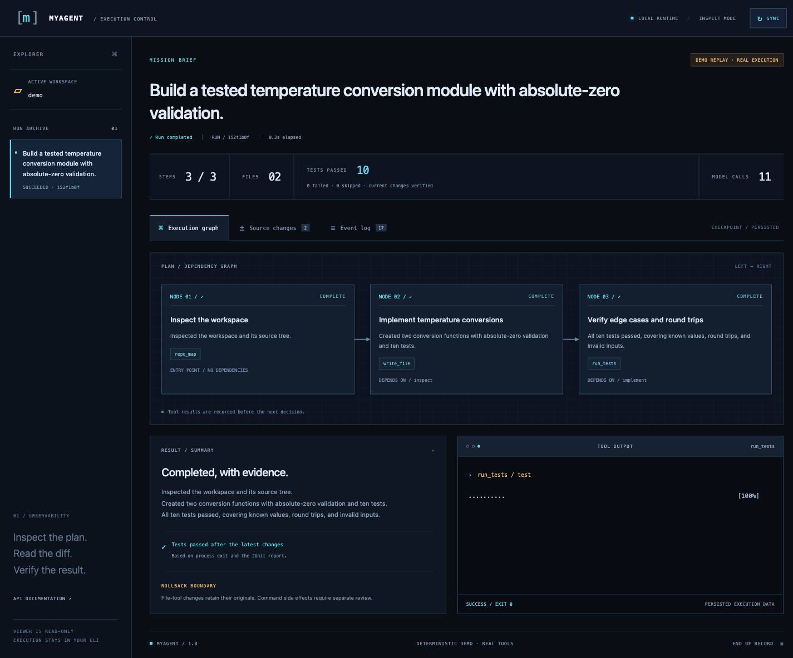
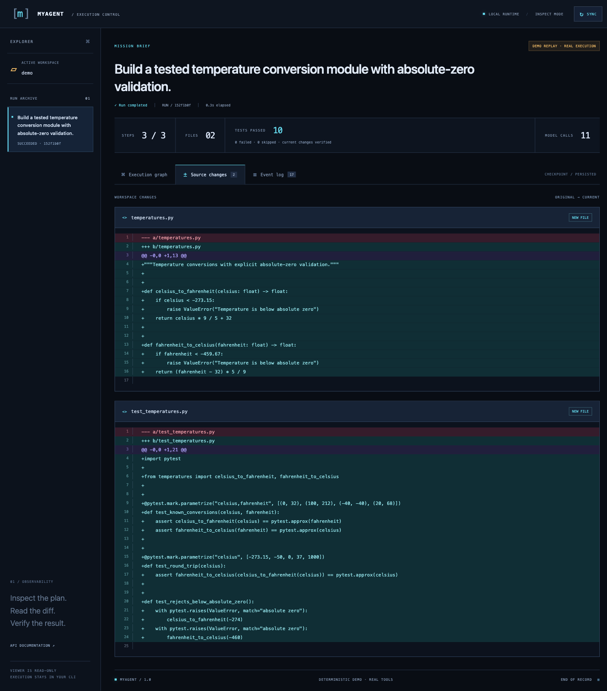
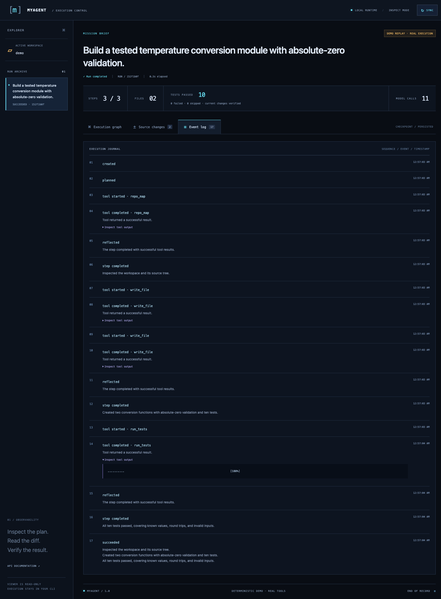
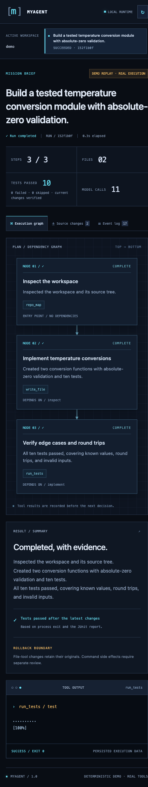

# Interface gallery

Captured in Chromium from the redesigned application on 2026-09-08. See [design notes](DESIGN.md) for layout and interaction decisions. Desktop viewport: 1440 × 1050; mobile viewport: 390 × 844. Original PNG dimensions are listed below.

MyAgent uses a labelled deterministic model replay. The files, ten passing tests, dependency relationships, tool output, and persisted events are real execution results. These screenshots do not establish live model performance.

## MyAgent — Execution Control

A dark developer console showing the real task dependency graph, verification results, and latest tool output.

1425 × 1184 PNG

## MyAgent — Source changes

Inspect actual file changes with line numbers and clear diff highlighting.

1425 × 1623 PNG

## MyAgent — Event log

A persisted execution journal with expandable tool output and timestamps.

1425 × 1935 PNG

## MyAgent — Mobile execution flow

A vertical dependency graph and stacked inspection panels for reviewing work on a narrow screen.

375 × 1993 PNG
